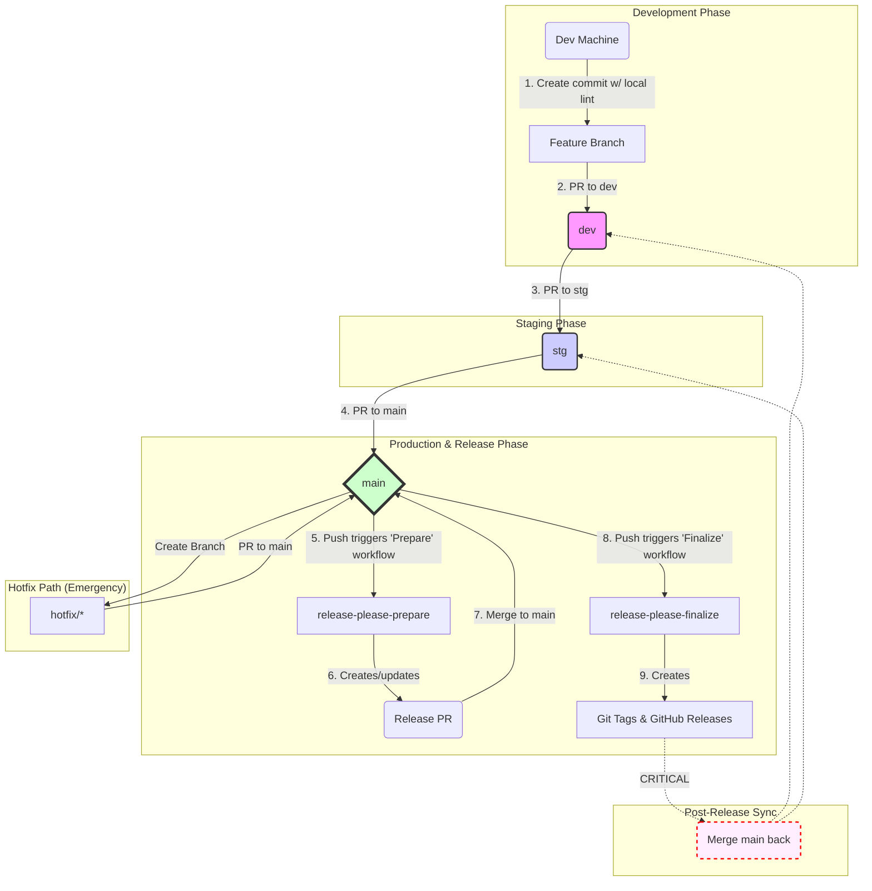

[English](./README.md) | [Español](./README.es.md) | [Русский](./README.ru.md)
***
# PoC de Release Please: Sistema de Versionado Automatizado

## Resumen Ejecutivo: El Valor de Negocio de la Automatización

Este documento detalla el sistema automatizado de versionado y lanzamiento implementado para este proyecto. Este resumen está destinado a todas las partes interesadas, incluidos gerentes de producto, directores técnicos y líderes de equipo, para aclarar el propósito y el valor de negocio de esta iniciativa de ingeniería.

### El Problema que Resolvimos

Anteriormente, el proceso de lanzar nuevas versiones de software era en gran medida manual. Este enfoque presentaba varios riesgos de negocio:
*   **Lento Time-to-Market:** Los procedimientos manuales consumían mucho tiempo, retrasando la entrega de nuevas características y correcciones de errores críticas a nuestros usuarios.
*   **Alto Riesgo de Error Humano:** Cada paso manual en el proceso de lanzamiento era un punto potencial de fallo, aumentando las posibilidades de desplegar código inestable en producción.
*   **Falta de Transparencia:** Era difícil crear un historial claro y auditable de qué cambios específicos se incluían en cada versión, complicando la planificación y el soporte.

### Nuestra Solución

Hemos implementado un sistema automatizado robusto y de dos fases, construido en torno a herramientas y prácticas estándar de la industria (`release-please` y `Conventional Commits`). Este sistema automatiza completamente la gestión de versiones, la generación del changelog y la creación de artefactos de lanzamiento. Impone un flujo de trabajo de desarrollo estricto y predecible, asegurando que cada cambio sea rastreado y validado.

### Impacto y Valor para el Negocio

1.  **Mayor Agilidad y Entrega más Rápida:** Al automatizar tareas rutinarias, reducimos drásticamente el "tiempo de entrega" (lead time) para los lanzamientos. Esto nos permite entregar valor a nuestros clientes más rápido, ya sea una nueva característica o un parche de seguridad crítico.
2.  **Fiabilidad y Estabilidad Mejoradas:** Automatizar el proceso elimina toda una clase de errores humanos. Esto conduce a despliegues más fiables, mayor tiempo de actividad y una mayor confianza del usuario en nuestro producto.
3.  **Transparencia y Auditabilidad Completas:** Cada lanzamiento ahora va acompañado automáticamente de un changelog detallado. Esto proporciona una visibilidad nítida para todas las partes interesadas. Los gerentes de producto pueden rastrear fácilmente la entrega de características, y los equipos de soporte pueden ver instantáneamente qué correcciones de errores se incluyen en una versión. Esto crea un historial de lanzamientos completamente auditable.
4.  **Mejor Enfoque y Productividad del Desarrollador:** Nuestros ingenieros ahora pueden centrarse en su tarea principal —construir un gran software— en lugar de verse agobiados por procedimientos de lanzamiento complejos y propensos a errores. Esto eleva la moral y nos permite innovar de manera más efectiva.

---

## 1. Guía de Inicio Rápido para Desarrolladores

Esta sección contiene todo lo que un desarrollador necesita saber para comenzar a trabajar en el proyecto.

### 1.1. CRÍTICO: Configuración Local por Primera Vez

Para asegurar un historial de Git consistente y habilitar nuestra automatización, este proyecto impone la validación de mensajes de commit en su máquina local usando `Husky` y `Commitlint`.

**Objetivo:**
*   **Prevención de Errores:** Bloquea commits con mensajes formateados incorrectamente antes de que se creen.
*   **Base de la Automatización:** Garantiza que todos los commits se adhieran al estándar en el que confían nuestras herramientas de lanzamiento.

**Cómo Activarlo:**
Para activar este sistema en su máquina local, siga estos pasos únicos:
1.  Instale [Node.js](https://nodejs.org/) (se recomienda la versión 18+).
2.  Ejecute el siguiente comando en el directorio raíz del proyecto:
    ```bash
    npm install
    ```
    Este comando descargará todas las herramientas de desarrollo necesarias y configurará automáticamente los Git hooks. **Sin este paso, la validación local de mensajes de commit no funcionará.**

### 1.2. La Regla de Oro: Conventional Commits

Todos los mensajes de commit y títulos de Pull Request en este proyecto **DEBEN** seguir la [especificación de Conventional Commits v1.0.0](https://www.conventionalcommits.org/es/v1.0.0/). Esto no es una preferencia de estilo; es el motor que impulsa todo nuestro sistema de automatización de lanzamientos.

#### Estructura del Commit

La estructura básica de un mensaje de commit es la siguiente:

```
<tipo>(<ámbito>): <asunto>
<LÍNEA EN BLANCO>
[cuerpo opcional]
<LÍNEA EN BLANCO>
[footer(s) opcional(es)]
```

#### Tipos Comunes

Aunque la especificación permite muchos tipos, utilizamos principalmente los siguientes:
*   `feat`: Una nueva característica para el usuario.
*   `fix`: Una corrección de error para el usuario.
*   `perf`: Un cambio de código que mejora el rendimiento.
*   `build`: Cambios que afectan el sistema de compilación o dependencias externas.
*   `ci`: Cambios en nuestros archivos de configuración de CI y scripts.
*   `docs`: Solo cambios en la documentación.
*   `refactor`: Un cambio de código que no corrige un error ni añade una característica.
*   `style`: Cambios que no afectan el significado del código (espacios en blanco, formato, etc.).
*   `test`: Añadir pruebas faltantes o corregir pruebas existentes.
*   `chore`: Otros cambios que no modifican el código fuente o de prueba.
*   `revert`: Revierte un commit anterior.

#### Impacto en el Versionado

El `tipo` del commit determina directamente cómo se incrementará el número de versión:
*   `feat` resulta en un incremento de versión **menor** (ej., `1.2.3` -> `1.3.0`).
*   `fix` o `perf` resulta en un incremento de versión de **parche** (ej., `1.2.3` -> `1.2.4`).
*   Un `!` después del tipo (ej., `feat!`) o un footer `BREAKING CHANGE:` resulta en un incremento de versión **mayor** (ej., `1.2.3` -> `2.0.0`).
*   Los commits `revert`, por defecto, no provocan un cambio de versión.

#### Reglas Específicas del Proyecto

Nuestra validación local (`.commitlintrc.json`) impone estas reglas adicionales:
1.  **Un `ámbito` es obligatorio** y debe ser uno de los valores predefinidos: `project`, `activity`, `payment`, `activity-schema`, `payment-schema` o `release`.
2.  **La línea del encabezado no debe exceder los 72 caracteres.**

---

## 2. Nuestro Flujo de Trabajo de Desarrollo

Esta sección describe el proceso estándar para contribuir con código al proyecto. Adherirse a este flujo de trabajo es esencial para mantener la estabilidad del código y habilitar nuestro sistema de lanzamiento automatizado.

### 2.1. Estrategia de Ramificación

Utilizamos un modelo de ramificación permanente y de múltiples etapas. El código fluye en una dirección, desde las ramas menos estables a las más estables.

`feature/*` -> `dev` -> `stg` -> `main`

*   `main`: Esta rama representa el código de producción actual. Es la rama más estable. Los pushes directos están prohibidos.
*   `stg` (Staging): Una rama de preproducción utilizada para pruebas de regresión finales. Debe ser un reflejo estable de lo que será el próximo lanzamiento.
*   `dev` (Development): La rama de integración principal para todas las nuevas características. Es una rama activa y de rápido movimiento.
*   `feature/*` o `fix/*`: Ramas de corta duración creadas a partir de `dev` para desarrollar nuevas características o correcciones de errores no críticas.

### 2.2. Ciclo de Vida de una Característica (Guía del Desarrollador)

Este es el proceso paso a paso para llevar su trabajo desde una idea hasta una característica fusionada.

#### **Paso 1: Crear una Rama de Característica (Feature Branch)**
Comience siempre creando una nueva rama desde la última versión de `dev`.
```bash
git checkout dev
git pull
git checkout -b feature/my-new-feature
```

#### **Paso 2: Desarrollar y Hacer Commits**
Realice su trabajo en la rama de característica. Cree commits pequeños y lógicos. Recuerde seguir el estándar de **Conventional Commits** para cada mensaje de commit.

#### **Paso 3: Crear un Pull Request a `dev`**
Cuando su trabajo esté completo, envíe su rama al repositorio y abra un Pull Request (PR) dirigido a la rama `dev`. **El título de su Pull Request TAMBIÉN DEBE seguir el estándar de Conventional Commits.** Esto es crítico porque este título se convertirá en el mensaje de commit final después del squash.

#### **Paso 4: Revisión de Código y Fusión en `dev`**
Su PR activará automáticamente varias verificaciones. Debe ser aprobado por al menos otro miembro del equipo y todas las verificaciones de estado deben pasar.
*   **Estrategia de Fusión:** Use **"Squash and merge"**. Esto colapsa todos los commits de su característica en un único y limpio commit en la rama `dev`.

#### **Paso 5 (para Gerentes de Lanzamiento): Promoción a Staging (`stg`)**
Una vez que un conjunto de características en `dev` está listo para las pruebas de regresión, un Gerente de Lanzamiento crea un Pull Request de `dev` a `stg`.
*   **Estrategia de Fusión:** Use **"Create a merge commit"**.
*   **Acción Requerida: Establecer Mensaje de Commit para Suprimir Ruido**
    Al fusionar, **DEBE** editar el mensaje de commit para usar el formato `chore(release)`. Este es un paso crítico para evitar que los commits de fusión "contaminen" el changelog final.
    ```
    chore(release): Promote dev to stg
    ```

#### **Paso 6 (para Gerentes de Lanzamiento): Promoción a Producción (`main`)**
Después de pruebas exitosas en `stg`, se crea un Pull Request de `stg` a `main`.
*   **Estrategia de Fusión:** Use **"Create a merge commit"**.
*   **Acción Requerida: Establecer Mensaje de Commit para Suprimir Ruido**
    Use el mismo formato `chore(release)` para el mensaje de commit de fusión.
    ```
    chore(release): Promote stg to main
    ```

#### **Paso 7: La Automatización Toma el Control**
Una vez que sus cambios llegan a la rama `main` a través del proceso de promoción, nuestro sistema de lanzamiento automatizado toma el control. **No se requiere ninguna acción manual adicional por su parte.** El sistema creará automáticamente un "Release PR" para su revisión. Después de que este PR sea fusionado, se creará el lanzamiento final.

Una explicación detallada de esta automatización está disponible en la sección "Arquitectura del Sistema".

---

## 3. Arquitectura del Sistema (Avanzado)
<details>
<summary>Haga clic para expandir y ver un análisis profundo de la arquitectura de CI/CD y Automatización de Lanzamientos.</summary>

### 3.1. Protección de Ramas a través de Rulesets
Para hacer cumplir nuestro flujo de trabajo y prevenir errores comunes, este repositorio utiliza la característica moderna de GitHub **Conjuntos de Reglas (Rulesets)**, que es más flexible que las "Reglas de protección de rama" heredadas. Esta guía lo guiará a través de la configuración.

#### Guía de Configuración Paso a Paso
Necesitará crear **dos** conjuntos de reglas:
*   **Un conjunto estricto:** para las ramas `main` y `stg`, donde la estabilidad es la máxima prioridad.
*   **Un conjunto flexible:** para la rama `dev`, donde la velocidad de desarrollo es la prioridad.

##### **Paso 1: Navegar a Configuración**
En su repositorio, vaya a `Configuración` > `Ramas` > `Conjuntos de reglas`.

##### **Paso 2: Crear el Conjunto de Reglas Estricto para `main` y `stg`**
1.  Haga clic en **"Nuevo conjunto de reglas de rama"**.
2.  **Nombre del conjunto de reglas:** Ingrese `Production & Staging Rules`.
3.  **Estado de aplicación:** Deje como `Activo`.
4.  **Ramas de destino:**
    *   Haga clic en **"Añadir destino"**.
    *   En el menú desplegable, seleccione **"Incluir por patrón"**.
    *   En el campo, ingrese `main,stg` y haga clic en `Añadir`. Esto aplica la regla a ambas ramas.
5.  **Configurar Reglas:** En la sección "Reglas de rama", active y configure las opciones como se especifica en la columna **"Configuración para `main` y `stg`"** en la tabla a continuación.
6.  Haga clic en **"Crear"**.

##### **Paso 3: Crear el Conjunto de Reglas Flexible para `dev`**
1.  Haga clic de nuevo en **"Nuevo conjunto de reglas de rama"**.
2.  **Nombre del conjunto de reglas:** Ingrese `Development Rules`.
3.  **Estado de aplicación:** Deje como `Activo`.
4.  **Ramas de destino:**
    *   Haga clic en **"Añadir destino"**.
    *   Seleccione **"Incluir por patrón"**.
    *   En el campo, ingrese `dev` y haga clic en `Añadir`.
5.  **Configurar Reglas:** Active y configure las opciones como se especifica en la columna **"Configuración para `dev`"** en la tabla a continuación.
6.  Haga clic en **"Crear"**.

#### Desglose Detallado de Reglas y Justificación

| Opción de la UI (de arriba a abajo)        | Configuración para `main` y `stg`        | Configuración para `dev`                  | Justificación                                                                                                                                |
|:-------------------------------------------|:-----------------------------------------|:------------------------------------------|:---------------------------------------------------------------------------------------------------------------------------------------------|
| **`Require a pull request before merging`**  | ✅ **Habilitado**                          | ✅ **Habilitado**                           | **Regla fundamental.** Asegura que todos los cambios pasen por una revisión de código y control.                                             |
| ↳ `Required approvals`                     | `1` (Recomendado)                        | `1` (Recomendado)                         | Asegura que al menos otra persona ha revisado los cambios. (Establecido en `0` para este PoC para máxima velocidad).                             |
| ↳ `Dismiss stale pull request approvals...`| ✅ **Habilitado**                          | ✅ **Habilitado**                           | **¡CRÍTICO!** Garantiza que los revisores aprueben la versión *final* del código, no una anticuada.                                          |
| ↳ `Require conversation resolution...`       | ✅ **Habilitado**                          | ✅ **Habilitado**                           | Bloquea la fusión si hay comentarios sin resolver. Todas las preguntas deben ser respondidas antes de fusionar.                               |
| **`Require status checks to pass...`**       | ✅ **Habilitado** (Añadir verificaciones)    | ✅ **Habilitado** (Añadir `Check PR Title`)   | Garantiza que el código solo se fusione después de que todas las puertas de calidad (pruebas, linting) estén en verde. Para `dev`, un título validado es el mínimo. |
| ↳ `Require branches to be up to date...`   | ✅ **Habilitado**                          | ❌ **Deshabilitado**                        | **¡IMPORTANTE!** Para `main`/`stg`, previene la fusión de PRs desactualizados y evita condiciones de carrera. Para `dev`, se deshabilita para aumentar la velocidad del flujo de trabajo. |
| **`Require linear history`**                 | ❌ **Deshabilitado**                       | ❌ **Deshabilitado**                        | Gestionamos las estrategias de fusión a través de `Allowed merge methods` abajo, que es más granular y explícito.                               |
| **`Allowed merge methods`**                  | ✅ Seleccionar **`Merge commit`** SÓLO     | ✅ Seleccionar **`Squash and merge`** SÓLO  | **¡CRÍTICO!** Para `main`/`stg`, preserva un historial limpio y lineal. Para `dev`, colapsa los commits de una característica en un único commit convencional limpio. |
| **`Block force pushes`**                     | ✅ **Habilitado**                          | ✅ **Habilitado**                           | **Regla obligatoria.** Protege la integridad y el historial compartido de todas las ramas clave contra sobrescrituras.                            |

### 3.1.1. Plan de Verificación
La fiabilidad de nuestro sistema de lanzamiento está garantizada por un plan de pruebas integral que valida todas las reglas de protección y la lógica de automatización. Este plan sirve como nuestros criterios de aceptación.

**[Ver la Estrategia de Pruebas Oficial](./TESTING_STRATEGY.es.md)**

### 3.1.2. Configuración Única para CI/CD
Al introducir estos flujos de trabajo de CI/CD en un nuevo repositorio por primera vez, se encontrará con el problema del "huevo y la gallina".
*   **El Problema:** Para fusionar un PR en una rama protegida, debe pasar la verificación de estado `Check PR Title`. Sin embargo, el archivo de flujo de trabajo que *ejecuta* esta verificación (`lint-pr-title.yml`) solo existe dentro del propio PR y aún no está en la rama de destino. GitHub no puede ejecutar un flujo de trabajo que no conoce.
*   **La Solución:** Para fusionar el primer PR que introduce los archivos de CI/CD, debe deshabilitar temporalmente la verificación de estado requerida para esa única fusión.
    1.  Vaya a `Configuración > Ramas > Conjuntos de reglas` y edite el conjunto de reglas para `dev`.
    2.  Elimine temporalmente `Check PR Title` de la lista de verificaciones de estado requeridas y guarde.
    3.  Fusione el Pull Request que contiene los nuevos archivos de CI/CD.
    4.  **Inmediatamente** regrese al conjunto de reglas de `dev` y vuelva a agregar `Check PR Title` a la lista de verificaciones de estado requeridas.

### 3.2. Sistema de Lanzamiento Automatizado (`release-please`)
Para automatizar el versionado y la generación de notas de lanzamiento, este proyecto utiliza la herramienta de Google `release-please`. El sistema se basa en un flujo de trabajo inteligente de dos fases gestionado por un único archivo de GitHub Actions (`release-please.yml`).

#### Fase 1: Preparación del Lanzamiento (El "Release PR")
Este es el resultado principal de la fase de preparación, activado por cualquier push a la rama `main` que no provenga de un PR de lanzamiento anterior.
*   **Acción:** El flujo de trabajo ejecuta `release-please`, que analiza los nuevos commits `feat`/`fix` desde el último lanzamiento.
*   **Resultado (El "Release PR"):** Crea (o actualiza) un único Pull Request persistente. Este "Release PR" sirve como un área de preparación para el próximo lanzamiento y contiene:
    1.  **`CHANGELOG.md`:** Un resumen autogenerado de todos los nuevos cambios.
    2.  **`.release-please-manifest.json`:** Una actualización de los números de versión para todos los componentes afectados.
*   **Acción Requerida:** Un desarrollador debe revisar y **fusionar** este PR en `main` para aprobar el lanzamiento.

#### Fase 2: Finalización del Lanzamiento (Tags de Git y Releases de GitHub)
Esta fase se activa al fusionar el "Release PR" en la rama `main`.
*   **Acción:** El mismo flujo de trabajo detecta que el push provino de la fusión de un Release PR y cambia a la lógica de finalización.
*   **Resultado:** El sistema crea automáticamente:
    1.  **Tags de Git:** Un tag de Git específico del componente para cada componente actualizado en el manifiesto (ej., `payment-v2.1.0`).
    2.  **Releases de GitHub:** Un Release de GitHub correspondiente para cada tag, poblado con notas del `CHANGELOG.md`.
*   **Acción Requerida:** Ninguna. Esta fase está completamente automatizada.

#### Post-Lanzamiento: CRÍTICO - Sincronizar la Rama `dev`
Después de que se crea con éxito un lanzamiento en `main`, la rama `main` ahora contiene cambios (como el `CHANGELOG.md` actualizado) que no están presentes en `dev`. Para prevenir futuros conflictos de fusión y asegurar que `dev` contenga todo el código de producción, `main` **DEBE** ser fusionada de vuelta en `dev`.

**Acción Requerida (realizada por el Gerente de Lanzamiento):**
Esta acción debe realizarse a través de un Pull Request para cumplir con las reglas de protección de la rama `dev`.

### 3.3. Proceso Especial: Hotfixes
Un hotfix es un parche crítico que debe ser desplegado a producción lo más rápido posible, saltándose el flujo estándar `dev -> stg`.

**El Flujo de Trabajo de Hotfix:**
1.  **Crear Rama:** La rama se crea directamente desde `main` (`git checkout -b hotfix/my-critical-fix main`).
2.  **Commit de la Corrección:** Se crea un commit usando Conventional Commits (ej., `fix(payment)!: Correct critical vulnerability`).
3.  **Pull Request:** Se abre un PR dirigido a la rama `main`.
4.  **Revisión y Fusión Acelerada:** Después de la aprobación, el PR se fusiona en `main`. Esto activará el proceso de finalización de `release-please`, creando el nuevo tag y lanzamiento del hotfix.
5.  **CRÍTICO - Sincronizar Descendentemente:** Inmediatamente después del lanzamiento del hotfix, `main` **DEBE** ser fusionada de vuelta en `stg` y `dev` para asegurar que la corrección se incorpore en todas las líneas de desarrollo activas.

### 3.4. Proceso Especial: El "Guardían" (Gatekeeper) (Mejora Futura)
Para proporcionar una capa adicional de cumplimiento técnico a nuestra estrategia de ramificación, se puede implementar un flujo de trabajo "Guardían". Sería una GitHub Action personalizada que se ejecuta en cada PR, verificando los nombres de las ramas de origen y destino para prevenir programáticamente fusiones incorrectas (ej., una rama `feature/*` intentando fusionarse directamente en `main`).

### 3.5. Diagrama de Arquitectura del Sistema
El siguiente diagrama ilustra el flujo de trabajo completo.


### 3.6. Identidad de Automatización y Permisos (Configuración Crítica)

**El Problema:** El `secrets.GITHUB_TOKEN` estándar, generado para cada ejecución de workflow, tiene permisos limitados y, lo más importante, no puede activar flujos de trabajo subsecuentes. Esto hace imposible nuestro proceso de dos fases (donde la fusión de un Release PR debe activar la fase de finalización).

**La Solución:** Debemos usar una identidad dedicada con permisos elevados. La forma más segura y recomendada es crear una **Aplicación de GitHub (GitHub App)**. A diferencia de los PAT de usuario, este método utiliza tokens de instalación de corta duración, lo que mejora significativamente la seguridad.

**Configuración Requerida (acción única por un administrador):**

1.  **Crear una GitHub App:**
    *   Vaya a `Configuración > Configuración de desarrollador > Aplicaciones de GitHub` y cree una nueva aplicación.
    *   Otórguele los **Permisos** necesarios:
        *   `Permisos del Repositorio > Contenidos`: `Lectura y escritura` (para actualizar `CHANGELOG.md` y manifiestos).
        *   `Permisos del Repositorio > Solicitudes de extracción (Pull requests)`: `Lectura y escritura` (para crear y fusionar el Release PR).

2.  **Instalar la App:** Instale la aplicación recién creada en su repositorio.

3.  **Generar una Clave Privada:** En la página de la aplicación, genere y descargue una clave privada (archivo `.pem`).

4.  **Guardar Secretos:** Añada dos secretos a su repositorio (`Configuración > Secretos y variables > Actions`):
    *   `RELEASE_APP_ID`: El ID de su GitHub App.
    *   `RELEASE_APP_PRIVATE_KEY`: El contenido de su archivo `.pem`.

**Integración en el Workflow (`release-please.yml`):**
Nuestro workflow ahora usa estos secretos para generar un token temporal antes de ejecutar `release-please`. Esto se hace usando la acción `tibdex/github-app-token`.
```yaml
jobs:
  release-please:
    runs-on: ubuntu-latest
    steps:
      # 1. Generar un token temporal en nombre de la GitHub App
      - name: Generate a token
        id: generate_token
        uses: tibdex/github-app-token@v2
        with:
          app_id: ${{ secrets.RELEASE_APP_ID }}
          private_key: ${{ secrets.RELEASE_APP_PRIVATE_KEY }}

      # 2. Ejecutar release-please con el token generado
      - name: Run release-please
        id: release
        uses: googleapis/release-please-action@v4
        with:
          token: ${{ steps.generate_token.outputs.token }}
          config-file: release-please-config.json
          manifest-file: .release-please-manifest.json
```

### 3.7. Escenarios Avanzados: Manejo de Reversiones (Rollbacks)

Esta sección describe cómo se comporta el sistema en situaciones no estándar y proporciona procedimientos recomendados para revertir cambios.

#### Escenario: Revertir un cambio con `git revert`
Esta es la forma **más segura, transparente y recomendada** de deshacer un cambio.
*   **Cómo funciona:** `git revert` crea un nuevo commit que deshace cambios anteriores. Nuestro sistema está configurado para aceptar el tipo `revert`.
*   **Comportamiento del Sistema:**
    1.  **Versionado:** Un commit de tipo `revert` **no incrementa el número de versión**.
    2.  **Changelog:** La acción de revertir **quedará registrada** en el `CHANGELOG.md` bajo una sección especial "Reverts", asegurando total transparencia.
*   **Acción Requerida:**
    1.  Ejecute `git revert <commit_hash>`.
    2.  Edite el mensaje del commit para que se ajuste al formato `revert(<ámbito>): <asunto>`.
*   **Confianza y Revisión de Código:** El sistema confía en el mensaje del commit. Es **responsabilidad de los revisores de código** asegurar que un commit marcado como `revert` no contenga nuevas características.

#### Acción Prohibida: `git reset --force`
**NUNCA** use `git reset` con un push forzado en ramas compartidas (`dev`, `stg`, `main`). Nuestros Conjuntos de Reglas están configurados para bloquear esta acción peligrosa.

</details>

---

## 4. Hoja de Ruta Futura y Procedimientos de Emergencia

### 4.1. Deuda Técnica y Mejoras Futuras
Esta sección rastrea las mejoras planificadas para el sistema.
*   **Publicación Nativa de Artefactos:** Implementar un flujo de trabajo `publish.yml` nativo en GitHub Actions para manejar la compilación y publicación de artefactos, reduciendo la dependencia de sistemas externos.
*   **Pruebas E2E Automatizadas del Sistema de Lanzamiento:** Crear un flujo de trabajo de pruebas de extremo a extremo completamente automatizado para validar el propio pipeline de lanzamiento dentro de CI.

### 4.2. Procedimientos de Emergencia ("Válvula de Escape")
En caso de un mal funcionamiento grave de la automatización de lanzamientos:
1.  **Deshabilitar Flujo de Trabajo:** Vaya a `Actions` > `Release Please: Main Workflow` y "Disable workflow".
2.  **Limpieza:** Cierre manualmente cualquier "Release PR" incorrecto sin fusionar.
3.  **Lanzamiento Manual:** Si es necesario, se puede realizar un lanzamiento manual creando tags y releases a través de la UI de GitHub para desbloquear a los equipos.
4.  **Depuración:** Investigue la causa raíz del fallo del flujo de trabajo en una rama separada antes de volver a habilitar la automatización.
