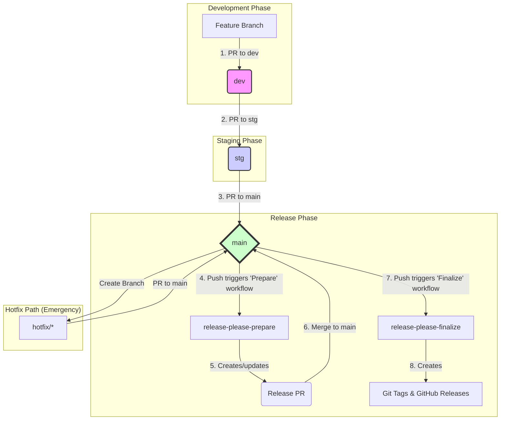

[English](./README.md) | [Español](./README.es.md) | [Русский](./README.ru.md)
***
# Release Please PoC: Automated Versioning System

## Executive Summary: The Business Value of Automation

This document details the automated versioning and release system implemented for this project. This summary is intended for all stakeholders, including product managers, technical directors, and team leads, to clarify the purpose and business value of this engineering initiative.

### The Problem We Solved

Previously, the process of releasing new software versions was largely manual. This approach presented several business risks:
*   **Slow Time-to-Market:** Manual procedures were time-consuming, delaying the delivery of new features and critical bug fixes to our users.
*   **High Risk of Human Error:** Each manual step in the release process was a potential point of failure, increasing the chances of deploying unstable code to production.
*   **Lack of Transparency:** It was difficult to create a clear, auditable history of what specific changes were included in each version, complicating planning and support.

### Our Solution

We have implemented a robust, two-phase automated system built around industry-standard tools and practices (`release-please` and `Conventional Commits`). This system fully automates version management, changelog generation, and the creation of release artifacts. It enforces a strict and predictable development workflow, ensuring that every change is tracked and validated.

### Business Impact & Value

1.  **Increased Agility & Faster Delivery:** By automating routine tasks, we drastically reduce the "lead time" for releases. This allows us to deliver value to our customers faster, whether it's a new feature or a critical security patch.
2.  **Enhanced Reliability & Stability:** Automating the process eliminates a whole class of human errors. This leads to more reliable deployments, higher uptime, and greater user trust in our product.
3.  **Complete Transparency & Auditability:** Every release is now automatically accompanied by a detailed changelog. This provides crystal-clear visibility for all stakeholders. Product managers can easily track feature delivery, and support teams can instantly see which bug fixes are included in a version. This creates a fully auditable release history.
4.  **Improved Developer Focus & Productivity:** Our engineers can now focus on their primary task—building great software—instead of being burdened by complex and error-prone release procedures. This boosts morale and allows us to innovate more effectively.

---

## 1. Developer Quick Start

This section contains everything a developer needs to know to start working on the project.

### 1.1. CRITICAL: First-Time Local Setup

To ensure a consistent Git history and enable our automation, this project enforces commit message validation on your local machine using `Husky` and `Commitlint`.

**Goal:**
*   **Error Prevention:** Blocks commits with improperly formatted messages before they are created.
*   **Automation Foundation:** Guarantees that all commits adhere to the standard our release tools rely on.

**How to Activate:**
To activate this system on your local machine, follow these one-time setup steps:
1.  Install [Node.js](https://nodejs.org/) (version 18+ is recommended).
2.  Run the following command in the project's root directory:
    ```bash
    npm install
    ```
    This command will download all necessary development tools and automatically configure the Git hooks. **Without this step, local commit message validation will not work.**

### 1.2. The Golden Rule: Conventional Commits

All commit messages and Pull Request titles in this project **MUST** follow the [Conventional Commits specification v1.0.0](https://www.conventionalcommits.org/en/v1.0.0/). This is not a style preference; it is the engine that powers our entire release automation system.

#### Commit Structure

The basic structure of a commit message is as follows:

```
<type>(<scope>): <subject>
<BLANK LINE>
[optional body]
<BLANK LINE>
[optional footer(s)]
```

#### Common Types

While the specification allows for many types, we primarily use the following:
*   `feat`: A new feature for the user.
*   `fix`: A bug fix for the user.
*   `perf`: A code change that improves performance.
*   `build`: Changes that affect the build system or external dependencies.
*   `ci`: Changes to our CI configuration files and scripts.
*   `docs`: Documentation only changes.
*   `refactor`: A code change that neither fixes a bug nor adds a feature.
*   `style`: Changes that do not affect the meaning of the code (white-space, formatting, etc.).
*   `test`: Adding missing tests or correcting existing tests.
*   `chore`: Other changes that don't modify `src` or `test` files.
*   `revert`: Reverts a previous commit.

#### Impact on Versioning

The `type` of the commit directly determines how the version number will be incremented:
*   `feat` results in a **minor** version bump (e.g., `1.2.3` -> `1.3.0`).
*   `fix` or `perf` result in a **patch** version bump (e.g., `1.2.3` -> `1.2.4`).
*   A `!` after the type (e.g., `feat!`) or a `BREAKING CHANGE:` footer results in a **major** version bump (e.g., `1.2.3` -> `2.0.0`).
*   `revert` commits, by default, do not trigger a version bump.

#### Project-Specific Rules

Our local validation (`.commitlintrc.json`) enforces these additional key rules:
1.  **A `scope` is mandatory** and must be one of the predefined values: `project`, `activity`, `payment`, `activity-schema`, `payment-schema`, or `release`.
2.  **The header line must not exceed 72 characters.**

---

## 2. Our Development Workflow

This section describes the standard process for contributing code to the project. Adhering to this workflow is essential for maintaining code stability and enabling our automated release system.

### 2.1. Branching Strategy

We use a permanent, multi-stage branching model. Code flows in one direction, from less stable to more stable branches.

`feature/*` -> `dev` -> `stg` -> `main`

*   `main`: This branch represents the current production code. It is the most stable branch. Direct pushes are forbidden.
*   `stg` (Staging): A pre-production branch used for final regression testing. It should be a stable reflection of what will become the next release.
*   `dev` (Development): The main integration branch for all new features. This is an active, fast-moving branch.
*   `feature/*` or `fix/*`: Short-lived branches created from `dev` for developing new features or non-critical bug fixes.

### 2.2. Feature Lifecycle (Developer's Guide)

This is the step-by-step process to get your work from an idea to a merged feature.

#### **Step 1: Create a Feature Branch**
Always start by creating a new branch from the latest version of `dev`.
```bash
git checkout dev
git pull
git checkout -b feature/my-new-feature
```

#### **Step 2: Develop and Commit**
Do your work on the feature branch. Create small, logical commits. Remember to follow the **Conventional Commits** standard for every commit message.

#### **Step 3: Create a Pull Request to `dev`**
When your feature is complete, push your branch to the repository and open a Pull Request (PR) targeting the `dev` branch. **The title of your Pull Request MUST also follow the Conventional Commits standard.** This is critical because this title will become the final commit message after squashing.

#### **Step 4: Code Review and Merge to `dev`**
Your PR will automatically trigger several status checks. It must be approved by at least one other team member and all status checks must pass.
*   **Merge Strategy:** Use **"Squash and merge"**. This collapses all your feature commits into a single, clean commit on the `dev` branch.

#### **Step 5 (for Release Managers): Promote to Staging (`stg`)**
Once a set of features in `dev` is ready for regression testing, a Release Manager creates a Pull Request from `dev` into `stg`.
*   **Merge Strategy:** Use **"Create a merge commit"**.
*   **Action Required: Set Commit Message to Suppress Noise**
    When merging, you **MUST** edit the commit message to use the `chore(release)` format. This is a critical step to prevent merge commits from "polluting" the final changelog.
    ```
    chore(release): Promote dev to stg
    ```

#### **Step 6 (for Release Managers): Promote to Production (`main`)**
After successful testing on `stg`, a Pull Request is created from `stg` into `main`.
*   **Merge Strategy:** Use **"Create a merge commit"**.
*   **Action Required: Set Commit Message to Suppress Noise**
    Use the same `chore(release)` format for the merge commit message.
    ```
    chore(release): Promote stg to main
    ```

#### **Step 7: Automation Takes Over**
Once your changes land in the `main` branch via the promotion process, our automated release system takes over. **No further manual action is required.** The system will automatically create a "Release PR" for review. After this PR is merged, the final release is created.

A detailed explanation of this automation is available in the "System Architecture" section.

---

## 3. System Architecture (Advanced)
<details>
<summary>Click to expand for a deep dive into the CI/CD and Release Automation architecture.</summary>

### 3.1. Branch Protection via Rulesets
To enforce our workflow and prevent common errors, this repository uses GitHub's modern **Rulesets** feature, which is more flexible than legacy "Branch protection rules". This guide will walk you through the setup.

#### Step-by-Step Setup Guide
You will need to create **two** rulesets:
*   **A strict set:** for the `main` and `stg` branches, where stability is the top priority.
*   **A flexible set:** for the `dev` branch, where development velocity is the priority.

##### **Step 1: Navigate to Settings**
In your repository, go to `Settings` > `Branches` > `Rulesets`.

##### **Step 2: Create the Strict Ruleset for `main` and `stg`**
1.  Click **"New branch ruleset"**.
2.  **Ruleset name:** Enter `Production & Staging Rules`.
3.  **Enforcement status:** Leave as `Active`.
4.  **Target branches:**
    *   Click **"Add target"**.
    *   From the dropdown, select **"Include by pattern"**.
    *   In the field, enter `main,stg` and click `Add`. This applies the rule to both branches.
5.  **Configure Rules:** In the "Branch rules" section, check and configure the options as specified in the **"Setup for `main` & `stg`"** column in the table below.
6.  Click **"Create"**.

##### **Step 3: Create the Flexible Ruleset for `dev`**
1.  Click **"New branch ruleset"** again.
2.  **Ruleset name:** Enter `Development Rules`.
3.  **Enforcement status:** Leave as `Active`.
4.  **Target branches:**
    *   Click **"Add target"**.
    *   Select **"Include by pattern"**.
    *   In the field, enter `dev` and click `Add`.
5.  **Configure Rules:** Check and configure the options as specified in the **"Setup for `dev`"** column in the table below.
6.  Click **"Create"**.

#### Detailed Rule Breakdown and Rationale

| UI Option (Top to Bottom)                  | Setup for `main` & `stg`                 | Setup for `dev`                             | Rationale                                                                                                                                              |
|:-------------------------------------------|:-----------------------------------------|:--------------------------------------------|:-------------------------------------------------------------------------------------------------------------------------------------------------------|
| **`Require a pull request before merging`**  | ✅ **Enabled**                             | ✅ **Enabled**                                | **Fundamental rule.** Ensures all changes undergo code review and control.                                                                             |
| ↳ `Required approvals`                     | `1` (Recommended)                        | `1` (Recommended)                           | Ensures that at least one other person has reviewed the changes. (Set to `0` for this PoC for max speed).                                                |
| ↳ `Dismiss stale pull request approvals...`| ✅ **Enabled**                             | ✅ **Enabled**                                | **CRITICAL!** Guarantees that reviewers approve the *final* version of the code, not an outdated one.                                                    |
| ↳ `Require conversation resolution...`       | ✅ **Enabled**                             | ✅ **Enabled**                                | Blocks merging if there are unresolved comments. All questions must be answered before merging.                                                        |
| **`Require status checks to pass...`**       | ✅ **Enabled** (Add checks)                | ✅ **Enabled** (Add `Check PR Title`)         | Guarantees that code only merges after all quality gates (tests, linting) are green. For `dev`, a linted title is the minimum bar.                       |
| ↳ `Require branches to be up to date...`   | ✅ **Enabled**                             | ❌ **Disabled**                             | **IMPORTANT!** For `main`/`stg`, this prevents merging outdated PRs and avoids race conditions. For `dev`, it's disabled to increase workflow velocity. |
| **`Require linear history`**                 | ❌ **Disabled**                            | ❌ **Disabled**                            | We manage merge strategies via `Allowed merge methods` below, which is more granular and explicit.                                                     |
| **`Allowed merge methods`**                  | ✅ Select **`Merge commit`** ONLY          | ✅ Select **`Squash and merge`** ONLY         | **CRITICAL!** For `main`/`stg`, this preserves a clean, linear history. For `dev`, it collapses feature commits into one clean conventional commit. |
| **`Block force pushes`**                     | ✅ **Enabled**                             | ✅ **Enabled**                                | **Mandatory rule.** Protects the integrity and shared history of all key branches from being overwritten.                                              |

### 3.1.1. Verification Plan
The reliability of our release system is guaranteed by a comprehensive test plan that validates all protection rules and automation logic. This plan serves as our acceptance criteria.

**[View the Official Testing Strategy](./TESTING_STRATEGY.md)**

### 3.1.2. One-Time Setup for CI/CD
When introducing these CI/CD workflows into a new repository for the first time, you will encounter a "chicken and egg" problem.
*   **The Problem:** To merge a PR into a protected branch, it must pass the `Check PR Title` status check. However, the workflow file that *runs* this check (`lint-pr-title.yml`) only exists within the PR itself and is not yet in the target branch. GitHub cannot run a workflow that it doesn't know about yet.
*   **The Solution:** To merge the very first PR that introduces the CI/CD files, you must temporarily disable the required status check for that single merge.
    1.  Go to `Settings > Branches > Rulesets` and edit the ruleset for `dev`.
    2.  Temporarily remove `Check PR Title` from the list of required status checks and save.
    3.  Merge the Pull Request containing the new CI/CD files.
    4.  **Immediately** go back to the `dev` ruleset and re-add `Check PR Title` to the list of required status checks.

### 3.2. Automated Release System (`release-please`)
To automate versioning and release notes generation, this project uses Google's `release-please` tool. The system is built around an intelligent, two-phase workflow managed by a single GitHub Actions file (`release-please.yml`).

#### Stage 1: Release Preparation (The "Release PR")
This is the primary output of the preparation stage, triggered by any push to the `main` branch that doesn't come from a previous release PR.
*   **Action:** The workflow runs `release-please`, which analyzes new `feat`/`fix` commits since the last release.
*   **Result (The "Release PR"):** It creates (or updates) a single, persistent Pull Request. This "Release PR" serves as a staging area for the next release and contains:
    1.  **`CHANGELOG.md`:** An auto-generated summary of all new changes.
    2.  **`.release-please-manifest.json`:** An update to the version numbers for all affected components.
*   **Action Required:** A developer must review and **merge** this PR into `main` to approve the release.

#### Stage 2: Release Finalization (Git Tags & GitHub Releases)
This stage is triggered by the merge of the "Release PR" into the `main` branch.
*   **Action:** The same workflow detects that the push came from merging a Release PR and switches to the finalization logic.
*   **Result:** The system automatically creates:
    1.  **Git Tags:** A component-specific Git tag for each component updated in the manifest (e.g., `payment-v2.1.0`).
    2.  **GitHub Releases:** A corresponding GitHub Release for each tag, populated with notes from the `CHANGELOG.md`.
*   **Action Required:** None. This stage is fully automated.

#### Post-Release: CRITICAL - Synchronize `dev` Branch
After a release is successfully created on `main`, the `main` branch now contains changes (like the updated `CHANGELOG.md`) that are not present in `dev`. To prevent future merge conflicts and ensure `dev` contains all production code, `main` **MUST** be merged back into `dev`.

**Required Action (performed by Release Manager):**
This action must be performed via a Pull Request to comply with the branch protection rules for `dev`.

### 3.3. Special Process: Hotfixes
A hotfix is a critical patch that must be deployed to production as quickly as possible, bypassing the standard `dev -> stg` flow.

**The Hotfix Workflow:**
1.  **Create Branch:** Branch directly from `main` (`git checkout -b hotfix/my-critical-fix main`).
2.  **Commit Fix:** Create a commit using the Conventional Commits standard (e.g., `fix(payment)!: Correct critical vulnerability`).
3.  **Pull Request:** Open a PR targeting the `main` branch.
4.  **Expedited Review & Merge:** After approval, merge the PR into `main`. This will trigger the `release-please` finalization process, creating the new hotfix tag and release.
5.  **CRITICAL - Synchronize Downstream:** Immediately after the hotfix is released, `main` **MUST** be merged back into `stg` and `dev` to ensure the fix is incorporated into all active development lines.

### 3.4. Special Process: The "Gatekeeper" (Future Enhancement)
To provide an additional layer of technical enforcement for our branching strategy, a "Gatekeeper" workflow can be implemented. This would be a custom GitHub Action that runs on every PR, checking the source and target branch names to programmatically prevent incorrect merges (e.g., a `feature/*` branch trying to merge directly into `main`).

### 3.5. System Architecture Diagram
The following diagram illustrates the complete workflow.


### 3.6. Automation Identity & Permissions (Critical Setup)

**The Problem:** The standard `secrets.GITHUB_TOKEN`, generated for each workflow run, has limited permissions and, most importantly, cannot trigger subsequent workflows. This makes our two-phase process (where merging a Release PR must trigger the finalization phase) impossible.

**The Solution:** We must use a dedicated identity with elevated permissions. The most secure and recommended way is to create a **GitHub App**. Unlike user PATs, this method uses short-lived installation tokens, which significantly enhances security.

**Required Setup (One-time action by an administrator):**

1.  **Create a GitHub App:**
    *   Navigate to `Settings > Developer settings > GitHub Apps` and create a new app.
    *   Grant it the necessary **Permissions**:
        *   `Repository permissions > Contents`: `Read and write` (to update `CHANGELOG.md` and manifests).
        *   `Repository permissions > Pull requests`: `Read and write` (to create and merge the Release PR).

2.  **Install the App:** Install the newly created app into your repository.

3.  **Generate a Private Key:** On the app's page, generate and download a private key (`.pem` file).

4.  **Store Secrets:** Add two secrets to your repository (`Settings > Secrets and variables > Actions`):
    *   `RELEASE_APP_ID`: The ID of your GitHub App.
    *   `RELEASE_APP_PRIVATE_KEY`: The content of your `.pem` file.

**Integration in Workflow (`release-please.yml`):**
Our workflow now uses these secrets to generate a temporary token before running `release-please`. This is done using the `tibdex/github-app-token` action.
```yaml
jobs:
  release-please:
    runs-on: ubuntu-latest
    steps:
      # 1. Generate a temporary token on behalf of the GitHub App
      - name: Generate a token
        id: generate_token
        uses: tibdex/github-app-token@v2
        with:
          app_id: ${{ secrets.RELEASE_APP_ID }}
          private_key: ${{ secrets.RELEASE_APP_PRIVATE_KEY }}

      # 2. Run release-please with the generated token
      - name: Run release-please
        id: release
        uses: googleapis/release-please-action@v4
        with:
          token: ${{ steps.generate_token.outputs.token }}
          config-file: release-please-config.json
          manifest-file: .release-please-manifest.json
```

### 3.7. Advanced Scenarios: Handling Rollbacks

This section describes how the system behaves and provides recommended procedures for rolling back changes.

#### Scenario: Rolling back a change with `git revert`
This is the **safest, most transparent, and recommended** way to undo a change.
*   **How it works:** `git revert` creates a new commit that undoes previous changes. Our system is configured to accept the `revert` type.
*   **System Behavior:**
    1.  **Versioning:** A `revert` commit **does not bump the version number**.
    2.  **Changelog:** The revert action **will be recorded** in the `CHANGELOG.md` under a special "Reverts" section, ensuring full transparency.
*   **Required Action:**
    1.  Run `git revert <commit_hash>`.
    2.  Edit the commit message to conform to the `revert(<scope>): <subject>` format.
*   **Trust and Code Review:** The automation system trusts the commit message. It is the **responsibility of the code reviewers** to ensure that a commit marked as `revert` does not contain new features or unrelated changes.

#### Prohibited Action: `git reset --force`
**NEVER** use `git reset` with a force push on shared branches (`dev`, `stg`, `main`). Our Branch Protection Rulesets are configured to block this dangerous action.

</details>

---

## 4. Future Roadmap & Emergency Procedures

### 4.1. Technical Debt & Future Enhancements
This section tracks planned improvements to the system.
*   **Native Artifact Publishing:** Implement a native `publish.yml` workflow to handle artifact building and publishing directly within GitHub Actions, reducing reliance on external systems.
*   **Automated E2E Testing:** Create a fully automated end-to-end testing workflow to validate the release pipeline itself within CI.

### 4.2. Emergency Procedures ("Escape Hatch")
In case of a major malfunction of the release automation:
1.  **Disable Workflow:** Go to `Actions` > `Release Please: Main Workflow` and "Disable workflow".
2.  **Clean Up:** Manually close any incorrect "Release PRs" without merging.
3.  **Manual Release:** If necessary, a manual release can be performed by creating tags and releases via the GitHub UI to unblock teams.
4.  **Debug:** Investigate the root cause of the workflow failure in a separate branch before re-enabling the automation.
