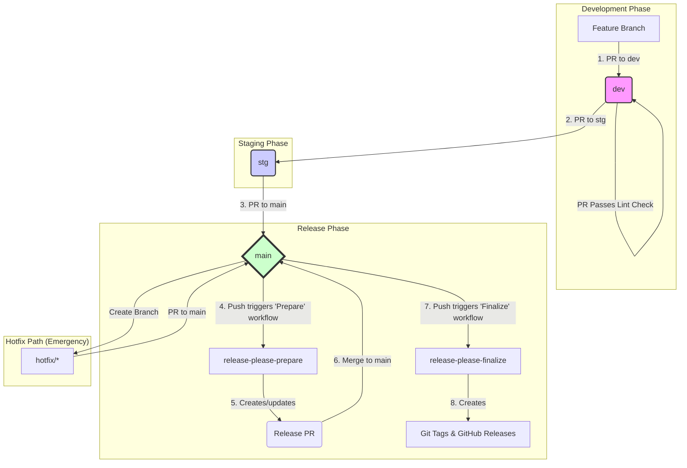

[English](./README.md) | [Español](./README.es.md) | [Русский](./README.ru.md)
***

# Release Please PoC: Автоматизированная Система Управления Версиями

## Краткое резюме: Бизнес-ценность автоматизации

Этот документ подробно описывает автоматизированную систему управления версиями и релизами, реализованную для данного проекта. Резюме предназначено для всех заинтересованных сторон, включая менеджеров по продукту, технических директоров и тимлидов, с целью разъяснения назначения и бизнес-ценности этой инженерной инициативы.

### Проблема, которую мы решили

Ранее процесс выпуска новых версий программного обеспечения был в значительной степени ручным. Этот подход создавал несколько бизнес-рисков:
*  **Медленный выход на рынок (Time-to-Market):** Ручные процедуры отнимали много времени, задерживая доставку новых функций и критических исправлений для наших пользователей.
*  **Высокий риск человеческой ошибки:** Каждый ручной шаг в процессе релиза был потенциальной точкой сбоя, что увеличивало шансы на развертывание нестабильного кода в производственной среде.
*  **Отсутствие прозрачности:** Было сложно создать четкую, аудируемую историю того, какие именно изменения были включены в каждую версию, что усложняло планирование и поддержку.

### Наше решение

Мы внедрили надежную, двухфазную автоматизированную систему, построенную на основе отраслевых стандартов и инструментов (`release-please` и `Conventional Commits`). Эта система полностью автоматизирует управление версиями, генерацию списка изменений (changelog) и создание артефактов релиза. Она обеспечивает строгий и предсказуемый рабочий процесс разработки, гарантируя, что каждое изменение отслеживается и проверяется.

### Влияние на бизнес и ценность

1. **Повышение гибкости и ускорение доставки:** Автоматизируя рутинные задачи, мы кардинально сокращаем "время выполнения" (lead time) для релизов. Это позволяет нам быстрее доставлять ценность нашим клиентам, будь то новая функция или критическое исправление безопасности.
2. **Улучшение надежности и стабильности:** Автоматизация процесса устраняет целый класс человеческих ошибок. Это приводит к более надежным развертываниям, повышению времени безотказной работы и укреплению доверия пользователей к нашему продукту.
3. **Полная прозрачность и аудируемость:** Каждый релиз теперь автоматически сопровождается подробным списком изменений. Это обеспечивает кристально ясную видимость для всех заинтересованных сторон. Менеджеры по продукту могут легко отслеживать доставку функций, а команды поддержки могут мгновенно видеть, какие исправления включены в версию. Это создает полностью аудируемую историю релизов.
4. **Повышение фокуса и производительности разработчиков:** Наши инженеры теперь могут сосредоточиться на своей основной задаче — создании отличного программного обеспечения — вместо того, чтобы заниматься сложными и подверженными ошибкам процедурами релиза. Это повышает моральный дух и позволяет нам быстрее внедрять инновации.

---
## 1. Быстрый старт для разработчика

Этот раздел содержит все, что нужно знать разработчику для начала работы над проектом.

### 1.1. КРИТИЧЕСКИ ВАЖНО: Первоначальная локальная настройка

Для обеспечения согласованной истории Git и работы нашей автоматизации, этот проект требует проверки сообщений коммитов на вашей локальной машине с помощью `Husky` и `Commitlint`.

**Цель:**
*  **Предотвращение ошибок:** Блокировка коммитов с неправильно отформатированными сообщениями до их создания.
*  **Основа для автоматизации:** Гарантия того, что все коммиты соответствуют стандарту, на который полагаются наши инструменты для релизов.

**Как активировать:**
Чтобы активировать эту систему на вашей локальной машине, выполните следующие одноразовые шаги:
1. Установите [Node.js](https://nodejs.org/) (рекомендуется версия 18+).
2. Выполните следующую команду в корневой директории проекта:
  ```bash
  npm install
  ```
Эта команда загрузит все необходимые инструменты для разработки и автоматически настроит Git-хуки. **Без этого шага локальная проверка сообщений коммитов работать не будет.**

### 1.2. Золотое правило: Conventional Commits

Все сообщения коммитов и заголовки Pull Request'ов в этом проекте **ОБЯЗАНЫ** следовать [спецификации Conventional Commits v1.0.0](https://www.conventionalcommits.org/ru/v1.0.0/). Это не стилистическое предпочтение; это движок, который приводит в действие всю нашу систему автоматизации релизов.

#### Структура коммита

Базовая структура сообщения коммита выглядит следующим образом:
```
<тип>(<область>): <тема>
<ПУСТАЯ СТРОКА>
[необязательное тело]
<ПУСТАЯ СТРОКА>
[необязательный футер(ы)]
```

#### Распространенные типы

Хотя спецификация допускает множество типов, мы в основном используем следующие:
*  `feat`: Новая функция для пользователя.
*  `fix`: Исправление ошибки для пользователя.
*  `perf`: Изменение кода, улучшающее производительность.
*  `build`: Изменения, влияющие на систему сборки или внешние зависимости.
*  `ci`: Изменения в наших файлах конфигурации CI и скриптах.
*  `docs`: Только изменения в документации.
*  `refactor`: Изменение кода, которое не исправляет ошибку и не добавляет новую функцию.
*  `style`: Изменения, не влияющие на смысл кода (пробелы, форматирование и т.д.).
*  `test`: Добавление недостающих тестов или исправление существующих.
*  `chore`: Прочие изменения, которые не изменяют исходный код или тесты.
*  `revert`: Отменяет предыдущий коммит.

#### Влияние на версионирование

`тип` коммита напрямую определяет, как будет увеличен номер версии:
*  `feat` приводит к увеличению **минорной** версии (например, `1.2.3` -> `1.3.0`).
*  `fix` или `perf` приводит к увеличению **патч**-версии (например, `1.2.3` -> `1.2.4`).
*  `!` после типа (например, `feat!`) или футер `BREAKING CHANGE:` приводит к увеличению **мажорной** версии (например, `1.2.3` -> `2.0.0`).
*  Коммиты типа `revert` по умолчанию не вызывают изменения версии.

#### Правила, специфичные для проекта

Наша локальная (`.commitlintrc.json`) и серверная (`lint-pr-title.yml`) валидация применяют следующие дополнительные правила:
1. **`область` обязательна** и должна быть одним из предопределенных значений: `project`, `activity`, `payment`, `activity-schema`, `payment-schema`, `release`, или областью CI/CD, такой как `dev`, `stg`, `main`, `ci`.
2. **Длина строки заголовка не должна превышать 72 символа.**

---
## 2. Наш рабочий процесс разработки

Этот раздел описывает стандартный процесс внесения кода в проект. Соблюдение этого процесса необходимо для поддержания стабильности кода и работы нашей автоматизированной системы релизов.

### 2.1. Стратегия ветвления

Мы используем постоянную, многоэтапную модель ветвления. Код движется в одном направлении, от менее стабильных к более стабильным веткам.

`feature/*` -> `dev` -> `stg` -> `main`

*  `main`: Эта ветка представляет текущий производственный код. Это самая стабильная ветка. Прямые пуши запрещены.
*  `stg` (Staging): Предпроизводственная ветка, используемая для финального регрессионного тестирования. Она должна быть стабильным отражением того, что станет следующим релизом.
*  `dev` (Development): Основная интеграционная ветка для всех новых функций. Это активная, быстро меняющаяся ветка.
*  `feature/*` или `fix/*`: Короткоживущие ветки, создаваемые из `dev` для разработки новых функций или некритических исправлений.

### 2.2. Жизненный цикл функции (Руководство для разработчика)

Это пошаговый процесс превращения вашей идеи в смерженную функцию.

#### **Шаг 1: Создание Feature-ветки**
Всегда начинайте с создания новой ветки от последней версии `dev`.
```bash
git checkout dev
git pull
git checkout -b feature/my-new-feature
```

#### **Шаг 2: Разработка и коммиты**
Выполняйте свою работу в feature-ветке. Создавайте небольшие, логичные коммиты. Не забывайте следовать стандарту **Conventional Commits** для каждого сообщения коммита.

#### **Шаг 3: Создание Pull Request в `dev`**
Когда ваша работа завершена, отправьте вашу ветку в репозиторий и откройте Pull Request (PR), нацеленный на ветку `dev`. **Заголовок вашего Pull Request'а ТАКЖЕ ДОЛЖЕН следовать стандарту Conventional Commits.** Это критически важно, так как этот заголовок станет финальным сообщением коммита после скваша.

#### **Шаг 4: Ревью кода и мерж в `dev`**
Ваш PR автоматически запустит несколько проверок. Он должен быть одобрен как минимум одним другим членом команды, и все проверки статуса должны пройти успешно.
*  **Стратегия мержа:** Используйте **"Squash and merge"**. Это объединит все коммиты вашей функции в один чистый коммит в ветке `dev`.

#### **Шаг 5 (для релиз-менеджеров): Продвижение в Staging (`stg`)**
Когда набор функций в `dev` готов к регрессионному тестированию, релиз-менеджер создает Pull Request из `dev` в `stg`.
*  **Стратегия мержа:** Используйте **"Create a merge commit"**.
*  **Обязательное действие: Установить сообщение коммита для подавления шума**
  При мерже вы **ОБЯЗАНЫ** отредактировать сообщение коммита, чтобы использовать формат `chore(release)`. Это критически важный шаг для предотвращения "загрязнения" финального чейнджлога коммитами о мерже.
  ```
  chore(release): Promote dev to stg
  ```

#### **Шаг 6 (для релиз-менеджеров): Продвижение в Production (`main`)**
После успешного тестирования в `stg`, создается Pull Request из `stg` в `main`.
*  **Стратегия мержа:** Используйте **"Create a merge commit"**.
*  **Обязательное действие: Установить сообщение коммита для подавления шума**
  Используйте тот же формат `chore(release)` для сообщения коммита мержа.
  ```
  chore(release): Promote stg to main
  ```

#### **Шаг 7: Автоматизация берет верх**
Как только ваши изменения попадают в ветку `main` в рамках процесса продвижения, наша автоматизированная система релизов берет на себя управление. **Никаких дальнейших ручных действий от вас не требуется.** Система автоматически создаст "Release PR" для ревью. После мержа этого PR будет создан финальный релиз.

Подробное объяснение этой автоматизации доступно в разделе "Архитектура системы".

---
## 3. Архитектура системы (Продвинутый уровень)

<details>
 <summary>Нажмите, чтобы развернуть для глубокого погружения в архитектуру CI/CD и автоматизации релизов.</summary>

### 3.1. Защита веток через Rulesets

Для обеспечения нашего рабочего процесса и предотвращения распространенных ошибок, этот репозиторий использует функцию GitHub **Rulesets**, настроенную в **`Settings > Branches > Rulesets`**. Эта современная система предоставляет технические гарантии для нашего процесса разработки. У нас есть три активных набора правил, каждый из которых нацелен на определенную ветку.

#### Набор правил: `main` (Production Branch)
**Цель:** Максимальная стабильность и аудируемость.

| Правило | Конфигурация | ПРИЧИНА |
| :--- | :--- | :--- |
| **Require a pull request** | Включено | Гарантирует, что все изменения проходят через формальное ревью. |
| **Require status checks to pass**| Включено | Гарантирует, что код сливается только после прохождения всех шлюзов качества. |
| **Require branches to be up-to-date** | **Включено** | **КРИТИЧЕСКИ ВАЖНО:** Предотвращает слияние устаревших PR в `main`, избегая гонок состояний. |
| **Block force pushes** | Включено | Защищает целостность и историю производственной ветки. |
| **Restrict deletions** | Включено | Предотвращает случайное удаление производственной ветки. |
| **Merge Controls** | Block `Squash`, Block `Rebase` | **КРИТИЧЕСКИ ВАЖНО:** Разрешен только "Merge commit", сохраняя чистую, линейную историю. |

#### Набор правил: `stg` (Staging Branch)
**Цель:** Предпроизводственная стабильность. Эта ветка зеркалирует правила `main`.

| Правило | Конфигурация | ПРИЧИНА |
| :--- | :--- | :--- |
| **Require a pull request** | Включено | Весь код должен быть проверен перед финальным тестированием. |
| **Require status checks to pass**| Включено | Гарантирует, что в staging разворачивается только качественный код. |
| **Require branches to be up-to-date**| **Включено** | Гарантирует, что `stg` всегда основан на последнем состоянии интегрируемого кода. |
| **Merge Controls** | Block `Squash`, Block `Rebase` | **КРИТИЧЕСКИ ВАЖНО:** Разрешен только "Merge commit", симулируя точный мерж, который произойдет в `main`. |

#### Набор правил: `dev` (Development Branch)
**Цель:** Быстрая скорость разработки при сохранении чистой, основанной на фичах истории коммитов, подходящей для `release-please`.

| Правило | Конфигурация | ПРИЧИНA |
| :--- | :--- | :--- |
| **Require a pull request** | Включено | Все изменения должны быть проверены. |
| **Require status checks to pass**| Включено | Проверка `Check PR Title` является минимальным шлюзом качества. |
| **Require branches to be up-to-date**| **Отключено** | **ВАЖНО:** Это сделано намеренно для увеличения скорости рабочего процесса. |
| **Merge Controls** | Block `Merge commit`, Block `Rebase`| **КРИТИЧЕСКИ ВАЖНО:** Разрешен только "Squash and merge", что обязательно для схлопывания всех коммитов фичи в один чистый conventional commit. |

### 3.1.1. План верификации

Надежность нашей системы релизов гарантируется комплексным планом тестирования, который проверяет все правила защиты и логику автоматизации. Этот план служит нашими критериями приемки.

➡️ **[Ознакомиться с официальной стратегией тестирования](./TESTING_STRATEGY.ru.md)**

### 3.1.2. Одноразовая настройка для CI/CD

При внедрении этих CI/CD воркфлоу в новый репозиторий в первый раз, вы столкнетесь с проблемой "курицы и яйца".

*  **Проблема:** Чтобы смержить PR в защищенную ветку, он должен пройти проверку статуса `Check PR Title`. Однако файл воркфлоу, который *запускает* эту проверку (`lint-pr-title.yml`), существует только внутри самого PR и еще не находится в целевой ветке. GitHub не может запустить воркфлоу, о котором он еще не знает.
*  **Решение:** Чтобы смержить самый первый PR, который вводит файлы CI/CD, вы должны временно отключить требуемую проверку статуса для этого одного мержа.
  1. Перейдите в `Settings > Branches > Rulesets` и отредактируйте набор правил для `dev`.
  2. Временно удалите `Check PR Title` из списка обязательных проверок и сохраните.
  3. Смержите Pull Request, содержащий новые файлы CI/CD.
  4. **Немедленно** вернитесь к набору правил для `dev` и снова добавьте `Check PR Title` в список обязательных проверок.

### 3.2. Автоматизированная система релизов (`release-please`)

Для автоматизации версионирования и генерации заметок к релизу этот проект использует инструмент от Google `release-please`. Система построена на интеллектуальном, двухфазном воркфлоу, управляемом одним файлом GitHub Actions (`release-please.yml`).

#### Фаза 1: Подготовка релиза (The "Release PR")
Это основной результат подготовительной фазы, запускаемый любым пушем в ветку `main`, который не исходит от предыдущего релизного PR.

*   **Действие:** Воркфлоу запускает `release-please`, который анализирует новые `feat`/`fix` коммиты с момента последнего релиза.
*   **Результат (The "Release PR"):** Он создает (или обновляет) один, постоянный Pull Request. Этот "Release PR" служит промежуточной зоной для следующего релиза и содержит:
    1.  **`CHANGELOG.md`:** Автоматически сгенерированное резюме всех новых изменений.
    2.  **`release-please-manifest.json`:** Обновление номеров версий для всех затронутых компонентов.
*   **Требуемое действие:** Разработчик должен проверить и **смержить** этот PR в `main`, чтобы одобрить релиз.

#### Фаза 2: Финализация релиза (Git-теги и GitHub-релизы)
Эта фаза запускается мержем "Release PR" в ветку `main`.

*   **Действие:** Тот же воркфлоу обнаруживает, что пуш произошел в результате мержа Release PR, и переключается на логику финализации.
*   **Результат:** Система автоматически создает:
    1.  **Git-теги:** Компонентно-специфичный Git-тег для каждого компонента, обновленного в манифесте (например, `payment-v2.1.0`).
    2.  **GitHub-релизы:** Соответствующий GitHub-релиз для каждого тега, заполненный заметками из `CHANGELOG.md`.
*   **Требуемое действие:** Нет. Эта фаза полностью автоматизирована.

#### После релиза: КРИТИЧЕСКИ ВАЖНО - Синхронизация ветки `dev`

После успешного создания релиза в `main`, ветка `main` теперь содержит изменения (например, обновленный `CHANGELOG.md`), которых нет в `dev`. Чтобы предотвратить будущие конфликты слияния и обеспечить, что `dev` содержит весь производственный код, `main` **ОБЯЗАНА** быть смержена обратно в `dev`.

**Требуемое действие (выполняется релиз-менеджером):**
Это действие должно выполняться через Pull Request, чтобы соответствовать правилам защиты ветки `dev`.

### 3.3. Специальный процесс: Хотфиксы

Хотфикс — это критическое исправление, которое должно быть развернуто в продакшен как можно быстрее, минуя стандартный поток `dev -> stg`.

**Рабочий процесс хотфикса:**
1. **Создание ветки:** Ветка создается напрямую из `main` (`git checkout -b hotfix/my-critical-fix main`).
2. **Коммит исправления:** Создается коммит с использованием Conventional Commits (например, `fix(payment)!: Correct critical vulnerability`).
3. **Pull Request:** Открывается PR, нацеленный на ветку `main`.
4. **Ускоренное ревью и мерж:** После одобрения, PR сливается в `main`. Это запустит процесс финализации `release-please`, создав новый тег и релиз хотфикса.
5. **КРИТИЧЕСКИ ВАЖНО - Синхронизация вниз по потоку:** Сразу после релиза хотфикса, `main` **ОБЯЗАНА** быть смержена обратно в `stg` и `dev`, чтобы исправление было включено во все активные линии разработки.

### 3.4. Специальный процесс: "Привратник" (Gatekeeper) (Будущее улучшение)

Для добавления дополнительного уровня технического принуждения к нашей стратегии ветвления, может быть реализован воркфлоу "Привратник". Это был бы кастомный GitHub Action, который запускается на каждом PR, проверяя имена исходной и целевой веток, чтобы программно предотвращать некорректные мержи (например, ветку `feature/*`, пытающуюся смержиться напрямую в `main`).

### 3.5. Диаграмма архитектуры системы

Следующая диаграмма иллюстрирует полный рабочий процесс.




### 3.6. Идентификация для автоматизации и права доступа (Критически важная настройка)

**Проблема:** Стандартный `secrets.GITHUB_TOKEN` не может запускать последующие воркфлоу, что необходимо для нашего двухфазного процесса релиза.

**Решение:** Мы должны использовать выделенный **сервисный аккаунт**, чтобы предоставить нашей автоматизации необходимые права.

**Требуемая настройка (одноразовое действие администратора):**
1.  **Создайте сервисный аккаунт:** Создайте новый, отдельный аккаунт GitHub (например, `my-company-bot`).
2.  **Предоставьте доступ:** Добавьте этого бота в качестве коллаборатора в репозиторий с ролью **`Write`**.
3.  **Сгенерируйте PAT:** Войдите под ботом и сгенерируйте Personal Access Token (classic) с правами `repo` и `workflow`.
4.  **Сохраните секрет:** Сохраните этот PAT в секретах репозитория как `RELEASE_PLEASE_POC_TOKEN`.

### 3.7. Продвинутые сценарии: Обработка откатов

Этот раздел описывает, как система ведет себя в нестандартных ситуациях и предоставляет рекомендуемые процедуры для отката изменений.

#### Сценарий: Откат через `git revert`

Это **самый безопасный, прозрачный и рекомендуемый** способ отменить изменение.

*   **Как это работает:** `git revert` создает новый коммит, который отменяет предыдущие изменения. Наша система настроена на прием типа `revert`.
*   **Поведение системы:**
    1.  **Версионирование:** Коммит типа `revert` **не увеличивает номер версии**.
    2.  **Чейнджлог:** Действие отката **будет записано** в `CHANGELOG.md` в специальном разделе "Reverts", обеспечивая полную прозрачность.
*   **Требуемое действие:**
    1.  Выполните `git revert <commit_hash>`.
    2.  Отредактируйте сообщение коммита, чтобы оно соответствовало формату `revert(<scope>): <subject>`.
*   **Доверие и Код-ревью:** Система автоматизации доверяет сообщению коммита. **Ответственность код-ревьюеров** — убедиться, что коммит, помеченный как `revert`, не содержит новых функций.

#### Запрещенное действие: `git reset --force`

**НИКОГДА** не используйте `git reset` с принудительным пушем на общих ветках (`dev`, `stg`, `main`). Наши Rulesets настроены на блокировку этого опасного действия.

</details>

---

## 4. Будущая дорожная карта и аварийные процедуры

### 4.1. Технический долг и будущие улучшения

Этот раздел отслеживает запланированные улучшения системы.

*   **КРИТИЧЕСКИ ВАЖНО: Внедрить PAT сервисного аккаунта:** Текущий PoC временно работает под личным PAT разработчика. Немедленный приоритет — миграция на PAT выделенного сервисного аккаунта, как описано в разделе 3.6.
*   **ПРОДВИНУТЫЙ УРОВЕНЬ: Переход на GitHub App:** Для максимальной безопасности PAT сервисного аккаунта в конечном итоге должен быть заменен на выделенное **GitHub-приложение** с использованием временных токенов установки.
*   **Нативная публикация артефактов:** Внедрить нативный `publish.yml` воркфлоу в GitHub Actions для обработки сборки и публикации артефактов, снижая зависимость от внешних систем.
*   **Автоматизированное E2E-тестирование системы релизов:** Создать полностью автоматизированный воркфлоу для сквозного тестирования самого конвейера релизов в CI.

### 4.2. Аварийные процедуры ("Аварийный люк")

В случае серьезного сбоя автоматизации релизов:
1.  **Отключите воркфлоу:** Перейдите в `Actions` > `Release Please: Main Workflow` и "Disable workflow".
2.  **Очистка:** Вручную закройте все некорректные "Release PR" без слияния.
3.  **Ручной релиз:** При необходимости, ручной релиз можно выполнить, создав теги и релизы через UI GitHub, чтобы разблокировать команды.
4.  **Отладка:** Исследуйте первопричину сбоя воркфлоу в отдельной ветке перед повторным включением автоматизации.
